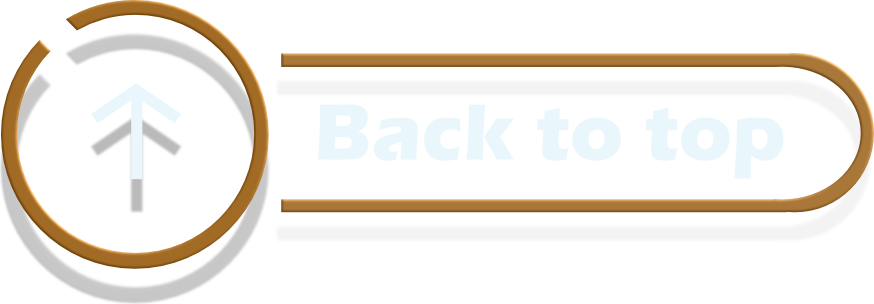

# UML

<!-- Main image  -->


```
(Unified Modeling Language)
```

# Sommaire

- [Introduction](#introduction)

# Navigation

- [Liste des dailys](./doc/liste_dailys.md)
- [Cas d'utilisation](./doc/dailys/cas_utilisation_classes.md)
- [Diagramme d'activité](./doc/dailys/diagramme_activité.md)
- [Diagramme de sequence](./doc/dailys/diagramme_sequence.md)
- [Diagramme_uml](./doc/dailys/diagramme_uml.md)


# Introduction

Les différents éléments présents dans l'UML (Unified Modeling Language) peuvent être regroupés en catégories selon leur rôle dans les **diagrammes structurels**, **comportementaux**, et **d'interaction**. Voici une explication détaillée de chaque type d'élément et de son rôle :

---


<a href="#sommaire">

</a>


