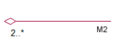

<a href="../../README.md">
  
</a>
<a href="../../doc/liste_dailys.md">
  
</a>


# Diagramme de classes

## Sommaire

- [x] Finir les objectifs de la veille

- [x] Approfondir les connaissances sur le diagramme de classes
  - [x] [Comprendre la notion d'association](#comprendre-la-notion-dassociation)
  - [x] [Etudier les différentes multiplicités et leur signification](#etudier-les-différentes-multiplicités-et-leur-signification)
  - [x] [Comprendre l'agrégation (losange vide)](#comprendre-lagrégation--losange-vide)
  - [x] [Comprendre la composition (losange plein)](#comprendre-la-composition-losange-plein)
  - [x] [Etudier les différences entre les 2](#etudier-les-différences-entre-les-2)
  - [x] [Intégrer les packages](#intégrer-les-packages)
- [x] [Comprendre l'héritage](#comprendre-lhéritage)
  - [x] Savoir représenter un généralisation / une spécialisation
  - [x] Représenter une classe abstraite
  - [x] Représenter une interface
- [x] Savoir lire un diagramme de classes complets

- [x] Cas pratiques
  - [x] Modéliser un système pour gérer les activités d'un cinéma (films, salles, séances)
  - [x] Modéliser la gestion d'une école
  - [x] Modéliser un système de gestion de projets (projets, équipes, membres, tâches, sous tâches)

<!--  -->


## Comprendre la notion d'association


### Définition :

Une association relie deux classes pour indiquer qu'elles interagissent ou sont connectées d'une certaine manière.

### Représentation UML

Une ligne simple entre deux classes, souvent annotée avec un nom de relation et parfois des rôles.

### Exemple :

Une classe Personne peut être associée à une classe Voiture par une relation "possède".

```
Une association dans un diagramme de classes UML représente une relation
entre deux ou plusieurs classes. Elle indique que des objets d'une classe
sont liés à des objets d'une autre classe.
```

## Exemple :

Une classe Professeur est associée à une classe Cours, ce qui signifie qu'un professeur peut enseigner un ou plusieurs cours.

## Caractéristiques :

Elle peut être unidirectionnelle (A connaît B) ou bidirectionnelle (A et B se connaissent).
Elle peut inclure un nom d'association pour indiquer la nature de la relation.


## Etudier les différentes multiplicités et leur signification

### Un peu comme dans Merise

```
Dans UML, la multiplicité est notée directement sur la ligne de relation.
Dans Merise, la cardinalité est indiquée entre parenthèses
 à côté des entités associées.
```

### Représentation UML :
Indiquée par des nombres ou des plages aux extrémités de la ligne d'association.

_1 :_ Une seule instance (relation 1:1).
0.._ : Aucune ou plusieurs instances (relation 1:N ou N:N).
1.._ : Au moins une instance.

## Comprendre l'agrégation ( losange vide)


**Agrégation composite** : Une relation forte où la vie du tout (composite) dépend de ses parties. Si le tout est détruit, les parties le sont aussi. Représentée par un losange plein dans un diagramme UML.



**Agrégation partagée** : Une relation faible où les parties peuvent exister indépendamment du tout. Représentée par un losange vide dans UML.


## Comprendre la composition (losange plein)

### Définition :

Une composition est une relation "tout-partie" forte où la partie dépend totalement du tout.

### Représentation UML :
Un losange plein à l'extrémité du "tout".

### Exemple :

Une Maison contient des Pièces. Si la maison est détruite, les pièces le sont également.

###

---

---

La **composition** dans un diagramme UML est une relation forte entre deux classes, où l'une (le tout) possède l'autre (la partie), et la durée de vie de la partie dépend entièrement de celle du tout.

### **Définition Simplifiée**

- **Relation forte** : Si le tout est détruit, ses parties le sont aussi.
- **Représentation UML** : Un **losange plein** à l'extrémité de la classe "tout".

---

### **Cas concret : Une Maison et ses Pièces**

#### **1. Classes impliquées**

- Classe `Maison` (le tout) :
  - Attributs : `adresse`, `nombreDePièces`.
- Classe `Pièce` (la partie) :
  - Attributs : `type` (exemple : chambre, salon), `superficie`.

#### **2. Relation entre les classes**

- Une maison est composée de pièces.
- Si la maison est détruite, les pièces n'ont plus de raison d'exister.

#### **Diagramme UML**

```
Maison ◼─── Pièce
```

- Le losange **plein** est côté `Maison`.
- Multiplicité :
  - Côté `Maison` : `1` (chaque pièce appartient à une seule maison).
  - Côté `Pièce` : `0..*` (une maison peut avoir zéro ou plusieurs pièces).


---


## Etudier les différences entre les 2


### Différences détaillées entre **Agrégation** et **Composition** dans UML

L’agrégation et la composition sont deux types de relations "tout-partie" dans les diagrammes UML, mais elles diffèrent dans la **force** de la relation et la **dépendance** entre le tout et ses parties.

---

| **Critère**               | **Agrégation (losange vide)**                                     | **Composition (losange plein)**                                      |
| ------------------------- | ----------------------------------------------------------------- | -------------------------------------------------------------------- |
| **Nature de la relation** | Relation faible (association "tout-partie" non exclusive).        | Relation forte (association "tout-partie" exclusive et obligatoire). |
| **Dépendance**            | Les parties peuvent exister indépendamment du tout.               | Les parties dépendent entièrement du tout pour leur existence.       |
| **Durée de vie**          | La destruction du tout n’entraîne pas la destruction des parties. | La destruction du tout entraîne automatiquement celle des parties.   |
| **Partage des parties**   | Les parties peuvent être partagées entre plusieurs "tout".        | Les parties appartiennent exclusivement à un "tout".                 |
| **Représentation UML**    | Losange vide sur la classe "tout".                                | Losange plein sur la classe "tout".                                  |
| **Exemple**               | Une bibliothèque contient des livres.                             | Une maison contient des pièces.                                      |

---

---

## Intégrer les packages


### Définition :

Les packages permettent de regrouper des classes liées pour mieux organiser un système complexe.

### Représentation UML :

Un rectangle avec un onglet supérieur gauche portant le nom du package.

### Exemple :

Un package GestionSalles peut contenir des classes Salle, Équipement, Projection.


# Comprendre l'héritage

## Définition :

Une classe abstraite encapsule des méthodes dites abstraites, c’est-à-dire dont le traitement n’est pas défini dans la classe. Par contre, les classes héritant d’une classe abstraite doivent obligatoirement redéfinir ses méthodes abstraites.

## Ce que c'est vraiment

L'héritage est un mécanisme qui permet à une classe (la classe fille) d'acquérir les propriétés et comportements d'une autre classe (la classe mère). En UML :

- La classe mère est appelée superclasse ou classe parente.
- La classe fille est appelée sous-classe ou classe dérivée.

## Généralisation / Spécialisation

### Définition

- La généralisation consiste à regrouper des classes similaires dans une classe parent commune (plus générale).
- La spécialisation consiste à créer des sous-classes qui héritent de la classe parent et ajoutent des propriétés ou des comportements spécifiques.

### Représentation concrète

- Une flèche pleine avec un trait continu pointe de la sous-classe vers la superclasse.

```
          +------------------+
          |   Animal         |   <-- Classe mère (superclasse)
          +------------------+
          | - nom: String    |
          | + seDeplacer()   |
          +------------------+
                 ^
                 |
      -----------------------
      |                     |
+------------------+   +------------------+
|   Chat           |   |   Chien          |  <-- Sous-classes
+------------------+   +------------------+
| + ronronner()    |   | + aboyer()       |
+------------------+   +------------------+
```

## Représenter une classe abstraite

Une classe abstraite est une classe qui ne peut pas être instanciée directement. Elle sert de base aux classes dérivées.

### Conventions pour une classe abstraite :

- Le nom de la classe est écrit en italique.
- Les méthodes abstraites sont également en italique.
- Ajouter le stéréotype <<abstract>> pour indiquer explicitement que la classe est abstraite.

```
+------------------------+
|      <<abstract>>      |
|       Forme            |   <-- Nom en italique
+------------------------+
| - couleur: String      |
+------------------------+
| + dessiner(): void     |   <-- Méthode abstraite (en italique)
+------------------------+
         ^
         |
----------------------------
|                          |
+------------------------+   +------------------------+
|   Rectangle           |   |   Cercle              |
+------------------------+   +------------------------+
| - largeur: int        |   | - rayon: int          |
+------------------------+   +------------------------+
| + dessiner(): void     |   | + dessiner(): void     |
+------------------------+   +------------------------+
```

## Représenter une interface

Une interface définit un contrat que les classes implémentent. Elle ne contient que des méthodes abstraites (et éventuellement des constantes).

- Conventions pour une interface :
- Utiliser le stéréotype <<interface>>.
- Le nom de l'interface est en normal (pas en italique).
- Les méthodes n'ont pas d'implémentation et sont listées comme abstraites.
- Une flèche en pointillés avec un triangle pointe de la classe implémentante vers l'interface.

## Représentation visuelle :

```
          +-----------------------+
          |      <<interface>>    |
          |       Dessinable      |   <-- Interface
          +-----------------------+
          | + dessiner(): void    |
          +-----------------------+
                  ^
                  |
         -------------------
         |                 |
+----------------+   +----------------+
| Rectangle      |   | Cercle         |   <-- Classes implémentant l'interface
+----------------+   +----------------+
| - largeur: int |   | - rayon: int   |
+----------------+   +----------------+
| + dessiner()   |   | + dessiner()   |
+----------------+   +----------------+

```

L'interface Dessinable est implémentée par les classes Rectangle et Cercle.
La flèche en pointillés indique que les classes concrètes s'engagent à fournir une implémentation de la méthode dessiner().

### Résumé des symboles UML

- [Heritage link](https://www.coursaline.com/format-texte/comprendre-les-classes-abstraites-en-UML/110)


---

<a href="#sommaire">
  
</a>
<a href="/README.md">
  
</a>
