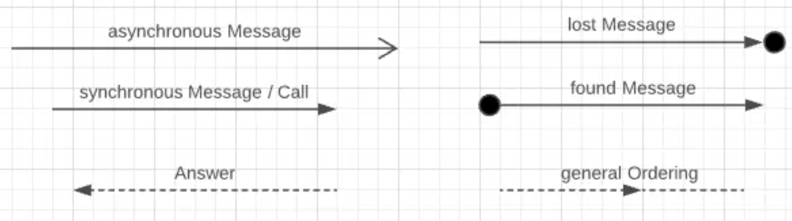

<a href="../../README.md">
  
</a>
<a href="../../doc/liste_dailys.md">
  
</a>


# UML - Diagramme de séquences

## Sommaire

- [x] [Découverte du diagramme de séquences](#découverte-du-diagramme-de-séquence)
  - [x] [Comprendre ses objectifs](#2-comprendre-ses-objectifs)
  - [x] [Identifier les différents éléments](#3-identifier-les-différents-éléments)
    - [x] [Les acteurs](#4-les-acteurs)
  - [x] [Les messages](#les-messages)
    - [x] [Comprendre et représenter les messages synchrones](#6-comprendre-et-représenter-les-messages-synchrones)
    - [x] [Comprendre et représenter les messages asynchrones](#7-comprendre-et-représenter-les-messages-asynchrones)
    - [x] [Comprendre et représenter les messages auto-référencées](#comprendre)
  - [x] [Comprendre et savoir utiliser les structures](#comprendre-et-savoir-utiliser-les-structures)
    - [x] [La structure alt](#1-alt-alternative)
    - [x] [La structure opt](#2-opt-option)
    - [x] [La structure loop](#3-loop-boucle)
    - [x] [La structure par](#4-par-parallèle)
    - [x] [La structure ref](#5-ref-référence)
- [x] [Comprendre le passage du diagramme de classes au diagramme de séquences](#comprendre-le-passage-du-diagramme-de-classes-au-diagramme-de-séquence)
  - [x] [Comment passer de l'un à l'autre](#2-comment-passer-de-lun-à-lautre)
  - [x] [Lien entre les classes et les acteurs](#3-lien-entre-les-classes-et-les-acteurs)
  - [x] [Comprendre l'utilité pour les développeurs](#4-comprendre-lutilité-pour-les-développeurs)
  - [x] [Comprendre la possibilité de génération de code](#5-comprendre-la-possibilité-de-génération-de-code)
- [x] [Cas pratiques :](#cas-pratiques-)
  - [ ] Modéliser le diagramme de séquences pour un système de réservation dans un restaurant
  - [ ] Modéliser le diagramme de séquences pour la réservation d'un livre dans une bibliothèque

<!--  -->




# Découverte du diagramme de séquence

Le **diagramme de séquence UML** est un outil qui représente **l'ordre temporel** des **interactions** entre des objets pour accomplir une tâche spécifique. Il montre **qui communique avec qui** et **dans quel ordre**, ce qui en fait un outil essentiel pour modéliser des comportements dynamiques.

---

## Comprendre ses objectifs

- **Visualiser les interactions** entre acteurs et objets.
- **Clarifier le flux d'exécution** pour un scénario précis (ex: création d'un utilisateur).
- **Décrire l’ordre temporel** des échanges de messages.
- **Identifier les responsabilités** de chaque objet.
- **Faciliter la compréhension** pour les développeurs, analystes et non-techniciens.

---

## Identifier les différents éléments

Les principaux éléments d’un diagramme de séquence sont :

1. **Acteurs** : Entités externes interagissant avec le système.
2. **Objets** : Instances de classes avec lesquelles les acteurs communiquent.
3. **Ligne de vie** : Ligne verticale représentant la durée d’existence d’un objet.
4. **Messages** : Flèches montrant les appels entre les objets.
5. **Activation** : Rectangle sur la ligne de vie montrant qu’un objet exécute une opération.
6. **Retour** : Flèches pointillées représentant le retour d’une méthode.
7. **Boucles et conditions** : Ex. `loop`, `alt`, `opt` pour des cas spécifiques.
8. **Messages auto-référencés** : Un objet s’appelle lui-même.

---

## Les acteurs

- **Rôle** : Les acteurs sont des entités externes qui interagissent avec le système (ex: utilisateur, système tiers).
- **Représentation** : Une **figure humaine stylisée** ou un rectangle avec un nom placé à gauche ou à droite.
- **Interaction** : L'acteur déclenche des messages vers les objets.

**Exemple :**

```plaintext
Utilisateur → [Objet Compte] : déposerArgent()
```


# Les messages

- Les **messages** sont des flèches représentant les **interactions** entre acteurs et objets.
- Chaque message correspond à l'**appel d'une méthode** ou d’une action.
- Ils incluent :
  - **Nom du message** : le nom de la méthode appelée.
  - **Flèche** : Direction de l’appel.

---

### **6. Comprendre et représenter les messages synchrones**

- Un **message synchrone** est un **appel bloquant** : l’émetteur attend la fin de l’exécution avant de continuer.
- **Représentation** : Une **flèche pleine** avec une **pointe pleine**.

**Exemple UML :**

```plaintext
ObjetA → ObjetB : calculer()
ObjetB → ObjetA : résultat  (flèche pointillée pour le retour)
```

- **Activation** : Lors de l’appel, un rectangle d’activation apparaît sur la ligne de vie de `ObjetB`.

---

### **7. Comprendre et représenter les messages asynchrones**

- Un **message asynchrone** ne bloque pas l’émetteur : il continue à exécuter d’autres actions sans attendre de réponse.
- **Représentation** : Une **flèche pleine** avec une **pointe ouverte**.

**Exemple UML :**

```plaintext
ObjetA → ObjetB : envoyerNotification()
```

- Les messages asynchrones sont courants dans les **systèmes distribués** ou les interactions basées sur des **queues de messages**.

---

### **8. Comprendre et représenter les messages auto-référencés**

- Un **message auto-référencé** est un appel **qu’un objet s’envoie à lui-même** (par exemple, une méthode qui s’appelle récursivement ou déclenche une autre méthode de la même classe).

**Représentation** :

- Une **flèche courbe** qui part et revient vers le même objet.
- L'activation montre la **durée de l'appel**.

**Exemple UML :**

```plaintext
ObjetA → ObjetA : vérifierConditions()
```

**Exemple visuel :**

```plaintext
+----------------+
|    ObjetA      |
+----------------+
      |
      |--------------+
      | vérifier()   |
      |--------------+
      |              |
```

---

### **Résumé des concepts**

| Élément                    | Description                                         | Représentation UML            |
| -------------------------- | --------------------------------------------------- | ----------------------------- |
| **Acteurs**                | Entité externe qui interagit avec le système.       | Figure humaine / Rectangle    |
| **Objets**                 | Instances de classes qui interagissent entre elles. | Rectangle avec nom            |
| **Message synchrone**      | Appel où l’émetteur attend la réponse.              | Flèche pleine, pointe pleine  |
| **Message asynchrone**     | Appel où l’émetteur **n’attend pas** la réponse.    | Flèche pleine, pointe ouverte |
| **Message auto-référencé** | Appel d’un objet vers lui-même.                     | Flèche courbée                |
| **Activation**             | Représente l’exécution d’une méthode.               | Rectangle sur la ligne de vie |
| **Message de retour**      | Résultat d’une méthode.                             | Flèche pointillée             |

---


# Comprendre et savoir utiliser les structures

Voici des explications plus précises pour chaque opérateur **UML** dans un **diagramme de séquence**, avec 200 caractères supplémentaires et en abordant les subtilités comme **`<0..*>`** ou d’autres notations spécifiques.

---

### **1. Alt (alternative)**

- **Alt** représente un **if/else**. Chaque section possède une condition `[condition]`. L'une des branches est exécutée si sa condition est vraie.
- Le **`else`** gère l’autre cas.

**Exemple UML** :

```plaintext
alt [x > 10]
   actionA()
else [x <= 10]
   actionB()
end alt
```

- Ici, `actionA` ou `actionB` sera exécutée selon la valeur de `x`.

---

---

### **2. Opt (option)**

- **Opt** est comme un `if` sans `else`. Le bloc est **exécuté uniquement** si la condition est vraie.
- Si la condition est fausse, le bloc est simplement ignoré.

**Exemple UML** :

```plaintext
opt [userLoggedIn]
   showProfile()
end opt
```

### **3. Loop (boucle)**

- Le bloc **loop** exécute un groupe d'interactions de manière **répétée** tant qu'une condition `[condition]` est vraie.
- **`<0..*>`** signifie qu’une interaction peut être répétée **0 ou plusieurs fois**, selon la condition.

**Exemple UML** :

```plaintext
loop [i < 5]
   action()
end loop
```

- Le `<0..*>` précise le nombre d'itérations possibles (0 fois si la condition est immédiatement fausse).

---

- Ici, `showProfile()` s'exécute seulement si `userLoggedIn` est vrai.

---

### **4. Par (parallèle)**

- **Par** représente des interactions **parallèles**. Les branches séparées par `and` s’exécutent **simultanément**.
- Cela peut montrer plusieurs processus ou threads.

**Exemple UML** :

```plaintext
par
   downloadFile()
and
   showProgress()
end par
```

- Les deux méthodes `downloadFile()` et `showProgress()` s’exécutent en même temps.

### **5. Ref (référence)**

- **Ref** appelle un **autre diagramme de séquence** déjà défini. Cela évite de **répéter** les interactions complexes.

**Exemple UML** :

```plaintext
ref AuthenticationSequence
```

- Cela signifie que le diagramme actuel fait appel à un sous-diagramme "AuthenticationSequence".


# Comprendre le passage du diagramme de classes au diagramme de séquence

### **Diagramme de classes :**

- **Statique** : Montre la structure du système avec les **classes**, leurs **attributs**, **méthodes**, et leurs relations (association, héritage, etc.).
- Il définit les **composants** du système.

### **Diagramme de séquence :**

- **Dynamique** : Montre **l'interaction** entre les objets des classes pour accomplir un scénario spécifique dans le temps.
- Il décrit **le comportement** d’une fonctionnalité.

---

## **2. Comment passer de l’un à l’autre**

1. **Sélection d’un scénario** :

   - Choisissez un cas d’utilisation ou une fonctionnalité (ex. : "Créer un utilisateur").

2. **Identifier les classes concernées** :

   - Depuis le diagramme de classes, repérez les classes qui interviendront dans le scénario.

3. **Instancier des objets** :

   - Créez des **objets** de ces classes dans le diagramme de séquence (ligne de vie).

4. **Tracer les messages** :
   - Ajoutez les **interactions** sous forme de messages pour montrer les **appels de méthodes** et les réponses.

**Exemple :**

| **Diagramme de classes**                   | **Diagramme de séquence**                           |
| ------------------------------------------ | --------------------------------------------------- |
| Classe `Utilisateur` avec méthode `save()` | Objet `Utilisateur1` appelle `save()` sur `DAO`.    |
| Classe `DAO` (Data Access Object)          | DAO répond à `save()` avec succès (message retour). |

---

## **3. Lien entre les classes et les acteurs**

### **Lien :**

- Les **acteurs** (externes) déclenchent des actions dans le système.
- Dans le diagramme de classes, les acteurs ne sont pas représentés.
- Dans le diagramme de séquence, **les acteurs** interagissent avec des **objets instanciés** à partir des classes.

**Exemple :**  
Un **acteur** "Utilisateur" déclenche une interaction avec la **classe** `Compte`.

```plaintext
Diagramme de séquence :
Utilisateur → Objet Compte → Méthode déposerArgent().
```

---

## **4. Comprendre l’utilité pour les développeurs**

1. **Clarification des interactions** :

   - Les développeurs voient comment les **objets interagissent** pour accomplir une tâche.

2. **Décomposition des responsabilités** :

   - Facilite la compréhension du **rôle** de chaque objet.

3. **Vérification du modèle statique** :

   - Le diagramme de séquence aide à valider que les méthodes définies dans le diagramme de classes suffisent pour répondre aux besoins.

4. **Communication claire** :
   - Offre une vision simple et **séquentielle** des flux pour les **équipes**.

---

## **5. Comprendre la possibilité de génération de code**

### **Génération automatique :**

- Les outils UML comme **StarUML**, **Visual Paradigm** ou **Enterprise Architect** permettent de **générer du code** depuis les diagrammes.
- Le diagramme de classes sert à générer les **structures de classes** (en Java, C#, etc.).
- Le diagramme de séquence peut aider à générer des **squelettes de méthodes**.

**Processus :**

1. **Diagramme de classes → Code** :
   - Création des classes, attributs, constructeurs et méthodes **vides**.
2. **Diagramme de séquence → Complétion** :
   - Ajout des appels de méthodes et de leur **séquence logique**.

**Exemple :**  
Si un diagramme de séquence montre `Utilisateur.save()`, l’outil peut générer :

```java
class Utilisateur {
    void save() {
        // À compléter
    }
}
```

---

# Cas pratiques :

## Process

- Scénario détaillé avec les fragments :
- Client envoie une demande de réservation au Système de Réservation.
- Système de Réservation vérifie la Base de Données pour voir s'il y a de la place.
- Si la place est disponible (alt - fragment conditionnel) :
  a. Le Système confirme la disponibilité au Client.
  b. Le Client valide la réservation.
  c. Le Système enregistre la réservation dans la Base de Données.
  Sinon :
  a. Le Système informe le Client que la réservation est impossible.
  Optionnellement (opt - fragment optionnel), une notification est envoyée au Personnel du Restaurant.

<a href="#sommaire">
  
</a>
<a href="/README.md">
  
</a>
