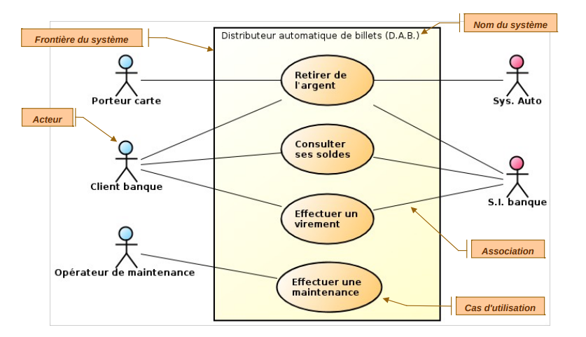

<a href="/README.md">
  
</a>
<a href="/doc/liste_dailys.md">
  
</a>


# GET STARTED UML

```
cas d'utilisation, classe, sequence, activité
```

## Sommaire

<!--  -->


- [x] [Découverte de l'UML](#découverte-de-luml)

  - [x] [Comprendre la signification de l'UML](#comprendre-la-signification-d-uml)
  - [x] [Pour quels besoins](#pour-quels-besoins-à-été-créé-uml)
  - [x] [Quels sont les objectifs d'utiliser UML](#quels-sont-les-objectifs-dutiliser-uml)
  - [x] [Comparaison avec la méthode MERISE ?](#comparaison-avec-la-méthode-merise)
  - [x] [Avantages / Inconvénients](#avantages--inconvénients-de-merise)

- [x] [Découverte des Diagrammes](#découverte-des-diagrammes)

  - [x] [Lister les types de diagrammes existants](#1-lister-les-types-de-diagrammes-existants)
  - [x] [Lister les diagrammes existants](#2-les-diagrammes-existants)
  - [x] [Comprendre l'intérêt de chacun des diagrammes](#3-comprendre-lintérêt-de-chacun-des-diagrammes)
  - [x] [Etudier les interactions existantes entre chacun des Diagrammes](#etudier)

- [x] [Découverte des outils](#découverte-des-outils-uml)
  - [x] [Trouver des outils type clients lourds](#1-trouver-des-outils-type-clients-lourds)
  - [x] [Trouver des outils cloud](#2-trouver-des-outils-cloud)
- [x] [Initiation au diagramme de cas d'utilisation](#initiation-au-diagramme-de-cas-dutilisation)
  - [x] [Comprendre les objectifs (d'un point de vue client / d'un point de vue développeur)](#1-comprendre-les-objectifs)
  - [x] [Comment représenter un système d'information complet](#2-comment-représenter-un-système-dinformation-complet)
  - [x] [Etudier les concepts clés du diagramme de cas d'utilisation](#3-étudier-les-concepts-clés-du-diagramme-de-cas-dutilisation)
    - [x] [les acteurs](#les-acteurs-)
  - [x] [les cas d'utilisation](#les-cas-dutilisation-)
  - [x] [le système](#le-système-)
  - [x] [Comprendre le lien entre les User Stories et les cas d'utilisation](#7-comprendre-le-lien-entre-les-user-stories-et-les-cas-dutilisation)
- [x] [Cas pratique](#cas-pratique)
  - [ ] Réaliser une carte mentale des diagrammes
  - [ ] Réaliser le diagramme de cas d'utilisation d'un DAB


# COMMENT CREER NOTRE DIAGRAMME DE CAS D'UTILISATION

### Se pose Trois questions :

- Définir les utilisations principales du système : à quoi sert il ?
- Définir l'environnement du système : qui va l"utiliser ou intérragir avec lui ?
- Définir les limittes du système : ou s'arrête sa responsabilité ?

### Créer un scénario d'utilisation :

- elle doit **décrire l'interraction en l'utilisateur et le système**
- et doit surtout **permettre à l'utilisateur de réaliser un objectif**

#### Par exemple :

Pour le système : **site de vente en ligne**
Nous avons le scenario suivant : **Commander**

##### Description :

- Le client s'authentifie dans le syeteme et choisi une adresse et un mode de livraison .
- le système indique le montant total de sa commande au client
- Le client donne ses informations de paiement
- la transaction est effectué et le systeme en informe le client par mail

### Cas d'utilisation :

- ensemble de scénarios réalisant un objectif de l'utilisateur
- Fonctionnalités principales du système du point de vue extérieur

**Acteur** : entité qui interragit avec le systeme

- Personne, capteur , chose logiciel exterieure au systeme
- Représente un role ( plusieus roles possibles pour une meme entité )
- Identifié par le nom de role

- Les utilisateurs peuvent avoir plusieurs roles ; par exemple si un utilisateur n'est pas encore connecté il est un usager non connecté mais il change de status pour personnage inscrit

**Cas d'utilisation** : Fonctionnalité visible de l'exterieur

- Action déclenchée par un acteur
- Identifié par une action (vere à l'infinitif )
- Vision du système centrée sur l'utilisateur

## Les elements du diagramme de cas d’utilisation :

#### Le système :

```
Représenté par une boîte rectangulaire, il délimite les frontières du système étudié.
```

#### Les acteurs :

```
Entités (humaines ou systèmes externes) interagissant avec le système.
```

#### Les cas d'utilisation :

```
Actions ou fonctionnalités que le système offre aux acteurs.
```

#### Relations :

```
Association : Interaction entre un acteur et un cas d’utilisation.
```

#### Include :

```
Un cas d’utilisation inclut un autre pour éviter les répétitions (réutilisation).
Extend : Un cas d’utilisation optionnel est ajouté sous certaines conditions.
```


# Découverte de l'UML

## Le sens des fleches


## Comprendre la signification d UML

L’UML **(Unified Modeling Language)** est un langage de modélisation graphique standardisé,**utilisé pour concevoir, visualiser et documenter des systèmes logiciels**. Il permet de représenter les aspects structurels et comportementaux d'un système grâce à des diagrammes.

## Pour quels besoins à été créé UML

- L’UML a été créé au milieu des années **1990** pour répondre aux défis de la conception de logiciels complexes.
- Il visait à **standardiser les méthodes de modélisation qui étaient nombreuses** et incompatibles (OMT, Booch, etc.),
- à simplifier la conception des systèmes et **à soutenir la programmation orientée objet**, alors en plein essor.
- UML **facilite la communication** entre les parties prenantes,
- améliore la qualité des logiciels **en identifiant les problèmes en amont**, et crée une documentation claire et durable pour des projets complexes.
- C’est un outil essentiel pour structurer et planifier les systèmes logiciels modernes.


## Quels sont les objectifs d'utiliser UML

L'UML vise à standardiser la modélisation logicielle, simplifier la conception de systèmes complexes, soutenir la programmation orientée objet, améliorer la communication entre équipes, détecter les problèmes tôt pour réduire les erreurs, et créer une documentation durable et claire.

## Comparaison avec la méthode MERISE

### Avantages / Inconvénients de l’UML

| **Avantages**                                                                 | **Inconvénients**                                               |
| ----------------------------------------------------------------------------- | --------------------------------------------------------------- |
| Langage standardisé, largement utilisé.                                       | Complexe à apprendre pour les débutants.                        |
| Flexible et adapté aux systèmes modernes.                                     | Peut être trop détaillé pour les petits projets.                |
| Permet de modéliser aussi bien la structure que le comportement d’un système. | Les diagrammes deviennent parfois trop denses.                  |
| Facilite la communication entre les parties prenantes.                        | Nécessite des outils spécialisés pour être pleinement exploité. |

---

### Avantages / Inconvénients de MERISE

| **Avantages**                                            | **Inconvénients**                                                   |
| -------------------------------------------------------- | ------------------------------------------------------------------- |
| Méthode simple et accessible.                            | Non adaptée aux projets orientés objet modernes.                    |
| Bien adaptée aux systèmes d’information classiques (SI). | Moins flexible face aux architectures complexes.                    |
| Bonne structuration des bases de données et des flux.    | Peu de prise en charge des concepts comportementaux ou interactifs. |


# Découverte des Diagrammes

### **Découverte des Diagrammes UML**

---

#### **1. Lister les types de diagrammes existants**

UML se divise en **deux grandes catégories** de diagrammes :

1. **Diagrammes structurels** : décrivent l'organisation statique du système.
2. **Diagrammes comportementaux** : illustrent la dynamique et les interactions dans le système.

---

#### **2. Les diagrammes existants**

| **Type**            | **Diagrammes UML**                                                                                                                                                                                      |
| ------------------- | ------------------------------------------------------------------------------------------------------------------------------------------------------------------------------------------------------- |
| **Structurels**     | - Diagramme de classes<br>- Diagramme d'objets<br>- Diagramme de composants<br>- Diagramme de déploiement<br>- Diagramme de structure composite<br>- Diagramme de paquets                               |
| **Comportementaux** | - Diagramme de cas d’utilisation<br>- Diagramme d’activités<br>- Diagramme d’états<br>- Diagramme de séquence<br>- Diagramme de communication<br>- Diagramme de synchronisation<br>- Diagramme de temps |

---

#### **3. Comprendre l’intérêt de chacun des diagrammes**

| **Diagramme**                        | **Description et intérêt**                                                                                             |
| ------------------------------------ | ---------------------------------------------------------------------------------------------------------------------- |
| **Diagramme de classes**             | Montre les classes, leurs attributs, méthodes et relations (héritage, association). Utile pour modéliser la structure. |
| **Diagramme d’objets**               | Représente des instances spécifiques de classes et leurs relations à un moment donné.                                  |
| **Diagramme de composants**          | Visualise les modules logiciels et leurs interconnexions. Pratique pour les architectures logicielles.                 |
| **Diagramme de déploiement**         | Illustre la répartition physique des composants sur les serveurs, machines ou appareils.                               |
| **Diagramme de cas d’utilisation**   | Décrit les interactions entre les utilisateurs (acteurs) et le système. Clarifie les besoins fonctionnels.             |
| **Diagramme d’activités**            | Modélise les flux de processus ou les workflows (exemple : processus métier, algorithmes).                             |
| **Diagramme d’états**                | Montre les transitions entre différents états d’un objet (exemple : "En attente" → "En cours").                        |
| **Diagramme de séquence**            | Illustre la chronologie des interactions entre objets ou acteurs.                                                      |
| **Diagramme de communication**       | Met en évidence les collaborations entre objets ou composants.                                                         |
| **Diagramme de temps**               | Décrit les changements dans les objets ou le système au fil du temps.                                                  |
| **Diagramme de structure composite** | Montre la composition interne des classes complexes.                                                                   |
| **Diagramme de paquets**             | Organise les éléments du système en regroupant les classes et autres composants.                                       |

---

### 4 Étudier les interactions entre les diagrammes

Les diagrammes UML sont complémentaires et interconnectés :

| **Interaction**                                            | **Exemple**                                                                                                      |
| ---------------------------------------------------------- | ---------------------------------------------------------------------------------------------------------------- |
| **Diagramme de cas d’utilisation ↔ Diagramme de séquence** | Les cas d’utilisation définissent des scénarios qui sont détaillés dans les diagrammes de séquence.              |
| **Diagramme de classes ↔ Diagramme d’objets**              | Les classes modélisent la structure, tandis que les objets en montrent les instances spécifiques.                |
| **Diagramme de composants ↔ Diagramme de déploiement**     | Les composants sont liés à leur déploiement physique sur les machines ou serveurs.                               |
| **Diagramme d’activités ↔ Diagramme de cas d’utilisation** | Les activités détaillent les processus identifiés dans les cas d’utilisation.                                    |
| **Diagramme de classes ↔ Diagramme d’états**               | Les transitions d’état dépendent des attributs et méthodes des classes modélisées.                               |
| **Diagramme de séquence ↔ Diagramme de temps**             | Les interactions temporelles dans un diagramme de séquence peuvent être approfondies dans un diagramme de temps. |

---


### Découverte des outils UML

#### **1. Trouver des outils type "clients lourds"**

Les **clients lourds** sont des logiciels installés localement sur un ordinateur pour concevoir et manipuler des diagrammes UML. Ces outils sont souvent performants et offrent de nombreuses fonctionnalités avancées.

| **Outil**                | **Description**                                                                             |
| ------------------------ | ------------------------------------------------------------------------------------------- |
| **StarUML**              | Logiciel puissant pour créer des diagrammes UML, adapté aux projets complexes.              |
| **Enterprise Architect** | Outil professionnel pour modéliser, concevoir et gérer des systèmes logiciels.              |
| **Visual Paradigm**      | Supporte UML, BPMN et bien plus, avec des outils de collaboration et de génération de code. |
| **ArgoUML**              | Outil open-source simple pour créer des diagrammes UML.                                     |
| **Modelio**              | Logiciel open-source prenant en charge UML et BPMN, avec des fonctionnalités d'extension.   |

---

#### **2. Trouver des outils cloud**

Les outils **cloud** permettent de travailler directement depuis un navigateur, sans installation locale. Ils sont souvent plus simples et adaptés à la collaboration en temps réel.

| **Outil**                  | **Description**                                                                   |
| -------------------------- | --------------------------------------------------------------------------------- |
| **Lucidchart**             | Plateforme en ligne pour créer des diagrammes UML et collaborer en temps réel.    |
| **Draw.io (Diagrams.net)** | Outil gratuit en ligne, simple à utiliser, avec des modèles pour UML.             |
| **Creately**               | Outil collaboratif pour diagrammes UML et gestion de projets visuels.             |
| **Cacoo**                  | Solution cloud pour diagrammes UML, avec des fonctionnalités de collaboration.    |
| **Gliffy**                 | Plateforme simple pour créer des diagrammes UML directement depuis un navigateur. |

---


## **Initiation au diagramme de cas d’utilisation**

---



#### **1. Comprendre les objectifs**

Les objectifs du diagramme de cas d’utilisation varient selon la perspective.

| **Point de vue** | **Objectifs**                                                                                 |
| ---------------- | --------------------------------------------------------------------------------------------- |
| **Client**       | Visualiser simplement les fonctionnalités disponibles dans le système.                        |
| **Développeur**  | Comprendre le contexte et les interactions concrètes entre les utilisateurs et l'application. |

---

#### **2. Comment représenter un système d'information complet**

Un diagramme de cas d’utilisation montre :

1. **Le système** : Représenté par une boîte rectangulaire, il délimite les frontières du système étudié.
2. **Les acteurs** : Entités (humaines ou systèmes externes) interagissant avec le système.
3. **Les cas d'utilisation** : Actions ou fonctionnalités que le système offre aux acteurs.
4. **Relations** :
   - **Association** : Interaction entre un acteur et un cas d’utilisation.
   - **Include** : Un cas d’utilisation inclut un autre pour éviter les répétitions (réutilisation).
   - **Extend** : Un cas d’utilisation optionnel est ajouté sous certaines conditions.

---

#### **3. Étudier les concepts clés du diagramme de cas d’utilisation**

| **Concept**               | **Description**                                                                       |
| ------------------------- | ------------------------------------------------------------------------------------- |
| **Les acteurs**           | Représentent les utilisateurs ou systèmes externes qui interagissent avec le système. |
| **Les cas d'utilisation** | Décrivent les fonctionnalités ou services offerts par le système aux acteurs.         |
| **Le système**            | La boîte rectangulaire délimitant ce qui appartient au système étudié.                |
| **Relations**             | Lien entre acteurs et cas d’utilisation ou entre cas d’utilisation eux-mêmes.         |

---

#### **4. Comprendre les acteurs**

- **Acteurs principaux** : Interagissent directement avec le système pour accomplir un objectif (exemple : un client réservant un billet).
- **Acteurs secondaires** : Soutiennent les processus principaux (exemple : un système de paiement).

---

#### **5. Comprendre les cas d’utilisation**

- Chaque cas d’utilisation correspond à une fonctionnalité ou un service spécifique du système.
- Ils sont représentés par des ellipses, avec leur nom au centre.
- Exemple : "Créer un compte", "Passer une commande".

---

#### **6. Comprendre le système**

- Représenté par une **boîte rectangulaire** englobant tous les cas d’utilisation.
- Tout ce qui se trouve **hors de la boîte** appartient aux acteurs externes ou à des systèmes tiers.

---

#### **7. Comprendre le lien entre les User Stories et les cas d’utilisation**

| **Aspect**           | **User Stories**                                                                                               | **Cas d’utilisation**                                                 |
| -------------------- | -------------------------------------------------------------------------------------------------------------- | --------------------------------------------------------------------- |
| **Définition**       | Descriptions courtes des besoins d’un utilisateur, souvent utilisées en méthode Agile.                         | Modélisation visuelle des interactions entre utilisateurs et système. |
| **Niveau de détail** | Plus simplifiée et narrative ("En tant qu’utilisateur, je veux…").                                             | Plus formelle et détaillée (diagramme UML).                           |
| **Objectif**         | Capturer les exigences métier de manière simple et compréhensible.                                             | Planifier et modéliser les interactions fonctionnelles.               |
| **Lien**             | Les cas d’utilisation traduisent les User Stories en fonctionnalités spécifiques, visualisées dans le système. |

---

## Cas pratique


<a href="#sommaire">
  
</a>
<a href="/README.md">
  
</a>
